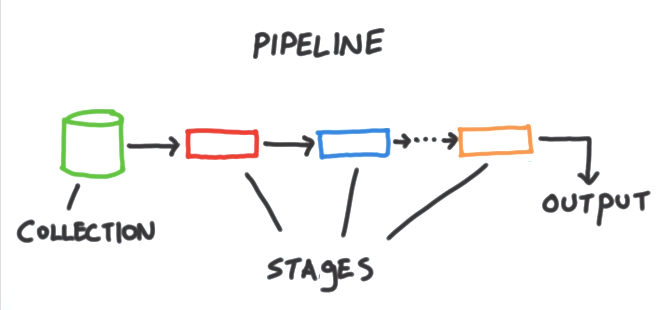

Finally we will explore how to query our MongoDB database in a more complex manner to obtain distributed computation and efficiently run queries that solve our analytic questions.

```{r}
library(mongolite)
a <- mongo(db = "test", collection = "agenda")
```

We have seen how to create, update, find (filter) and delete. But what about computation? Well, we can directly do some simple things, such as sort, limit or count documents.

```{r}
a$find('{}', sort = '{"age" : 1}')
```
```{r}
a$count('{"name" : "peter"}')
```

But when more complicated things need to be done, aggregation pipeline is the way to go. It allows us to define separate phases that will interact between them in a pipeline fashion. 



So if we would like to replicate the previous example using the aggregation pipeline, two stages need to be defined:

* *$match*: Find documents according to a given criteria
* *$sort*: Sort them according to a field and ascending (1) or descending (-1) order

```{r}
a$aggregate('[
            {"$match" : {}},
            {"$sort" : {"age" : 1}}
]')
```

But I don't want the *_id* field, *$project* projection stage needs to be added at the end.

```{r}
a$aggregate('[
            {"$match" : {}},
            {"$sort" : {"age" : 1}},
            {"$project" : {"_id" : 0}}
]')
```

Good thing is that we can put different stages at will inside our pipeline. So imagine we want to know which hobby is the most supported one. 

Given that MongoDB works at document level, we will need to *$unwind* all those values inside hobbies array in separate documents.

```{r}
a$aggregate('[
            {"$unwind" : "$hobbies"}
]')
```

Now we have a document per hobby, so we can *group* them back, selecting the hobby as _id and counting the number of documents falling into that group. When dollar symbol ($) is used in front of a field it refers to the value contained by the field so there will be as many _id values as distinct values inside *hobbies* field.

```{r}
a$aggregate('[
            {"$unwind" : "$hobbies"},
            {"$group" : {"_id" : "$hobbies", "support" : {"$sum" : 1}}}
]')
```

And we would like to see it sorted in descending order according to the amount of supporters.

```{r}
a$aggregate('[
            {"$unwind" : "$hobbies"},
            {"$group" : {"_id" : "$hobbies", "support" : {"$sum" : 1}}},
            {"$sort" : {"support" : -1}}
]')
```

Inside *$group* stages as many calculations as needed can be added. 

So, it should be easy to get the average age for each hobby.

```{r}
a$aggregate('[
            {"$unwind" : "$hobbies"},
            {"$group" : {"_id" : "$hobbies", "support" : {"$sum" : 1}, "avg_age" : {"$avg" : "$age"}}},
            {"$sort" : {"support" : -1}}
]')
```

Given that we will only consider the people whose age is less than 43, an initial *$match* stage needs to be added.

```{r}
a$aggregate('[
            {"$match" : {"age" : {"$lt" : 43}}},
            {"$unwind" : "$hobbies"},
            {"$group" : {"_id" : "$hobbies", "support" : {"$sum" : 1}, "avg_age" : {"$avg" : "$age"}}},
            {"$sort" : {"support" : -1}}
]')
```
If those calculations are valuable for us but costly to compute, they can be stored inside a collection using a final *$out* stage.

```{r}
a$aggregate('[
            {"$match" : {"age" : {"$lt" : 43}}},
            {"$unwind" : "$hobbies"},
            {"$group" : {"_id" : "$hobbies", "support" : {"$sum" : 1}, "avg_age" : {"$avg" : "$age"}}},
            {"$sort" : {"support" : -1}},
            {"$out" : "hobbies_datamart"}
]')
```

```{r}
m$run('{"listCollections":1}')
```

Good work.

**Lesson number 3: Aggregation pipeline is the way to compute things in MongoDB**