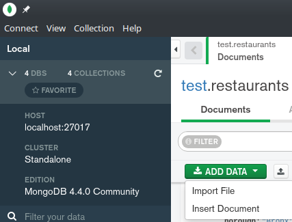
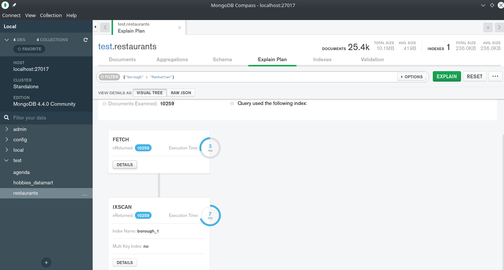

We will do an exercise using some more complicated documents but closer to real usage. There is a file containing restaurant information. An array of JSONs that can be easily ingested using mongolite's import functionality.

```{r}
library(mongolite)
r <- mongo(db = "test", collection = "restaurants")
r$import(file("restaurants.json"))
```

Done! How many documents are there?

```{r}
r$count()
```

That's simple enough. Now what? We could try to launch some queries...

```{r}
r$find(limit = 10)
```

But trying to infer the schema could be really tricky given that each document can be potentially different. 

For that it is much easier to use MongoDB's [Compass](https://www.mongodb.com/products/compass) tool that allows to explore the schema interactively.


From there it can be easily explored the information contained inside our collection, the percentage of data belonging to each data type inside a field or even the query to filter said information subset with a simple click.


Even if we have geospatial information we can get a map visualizing where each document information is geographically located.


Most of what we have done inside this notebook can be done using Compass in a more visual manner. 
Importing documents for example.



Or building aggregation pipelines.


Let's do some simple exercises.

### How many restaurants are located in Mahattan?

```{r}
df <- r$find('')
nrow(df)
```

### How many Chinese or Japanese restaurants are there? In Mahattan?

```{r}
df <- r$find('')
nrow(df)
```

### Any restaurant that has been closed latelly?

```{r}
df <- r$find('')
nrow(df)
```

### How many restaurants are there per borough?

```{r}
q <- '[
            {"$group" : {"_id" : "", "numrestaurants" : {}}
]'
r$aggregate(q)
```

### Show top 10 restaurants in Mahattan

We can also, for example, calculate the average score of the restaurants in Manhattan and sort them by grades in descending order, showing just the top 10.

```{r}
q <- '[
            {"$match" : {}},
            {"$unwind" : ""},
            {"$group" : {"_id" : "", "avggrade" : {}}},
            {"$sort" : {}},
            {"$limit" : 10}
]'
r$aggregate(q)
```

# On indexes and efficiency

How efficient is that query? As we already discussed, the only indexed field is the _id field so when we condition that aggregation by *borough* it needs to scan the whole collection to get the right documents to process.


```{r}
system.time(r$find('{"borough" : "Mahattan"}'))
```

Not bad but we can do a little bit better thanks to indexes. We can create an index on that field using Compass or just by calling following command.

```{r}
r$index(add = '{"borough" : 1}')
```


Thanks to that our query runs a little bit faster.

```{r}
system.time(r$find('{"borough" : "Mahattan"}'))
```


Indexes can be really useful and being MongoDB an operational database for 21st century applications, text and geospatial searches are included. Imagine that you would like to complement the previous request as follows...

# Find top 10 coffee houses near me

First, we will need to define what means *near me*. That is given my location and restaurant location I need to do a search for those that are at a given distance.

```{r}
r$index(add = '{ "address.coord" : "2d" }')
```

With that index created we can look for documents with location field informed and close to a given location (mine).

```{r}
r$find('{ "address.coord" : { "$geoWithin" : { "$center" : [ [-74, 40.74 ] , 0.01 ] } } }')
```

It certainly is more spectacular when used inside an application that shows it on a map.


Now, coffee houses... well anything with *coffee* on it. Text indexes will help us with that. We can look on a single field.

```mongodb
r$index(add = '{ "name" : "text" }')
```

Look in different fields.

```mongodb
r$index(add = '{ "name" : "text", "cuisine" : "text" }')
```

Or look on any text field using a wildcard.

```{r}
r$index(add = '{ "$**" : "text"}')
```

It takes a while but thanks to this we can use the *text* and *search* operators and look for coffee houses.

```{r}
r$find('{ "$text": { "$search": "cafe" } }')
```

As you see uppercase and lowercase now doesn't matter that much. We can also negate some terms such as tea.

```{r}
r$find('{ "$text": { "$search": "cafe -tea" } }')
```

So it should be easy now to at least filter the two requirements for our top 10 coffee houses nearby.

```{r}
r$find('{"$and" : [{ "address.coord" : { "$geoWithin" : { "$center" : [ [-74, 40.74 ] , 0.01 ] } } }, { "$text": { "$search": "cafe -tea" } }]}')
```

Not as impressive as in Compass :)


**Lesson number 4: Indexes are cool!**

